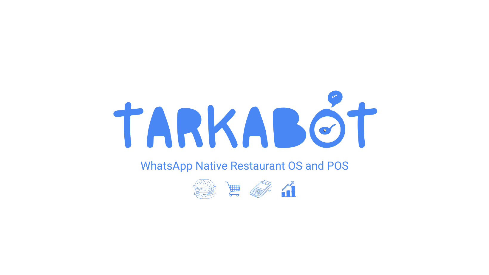

<div align="center">
  
</div>

# TarkaBot — WhatsApp-Native AI Restaurant Operating System (Multi-Tenant SaaS)

<div align="center">

[](https://tarkabot.online)
[](https://fastapi.tiangolo.com)
[](https://react.dev)
[](https://supabase.com)
[](https://github.com/EvolutionAPI/evolution-api)

</div>

---

## 🔗 Live Demo

- **Deployed:** [tarkabot.online](https://tarkabot.online)
- Backend health check: `/api/v1/health` on the deployed FastAPI service
- Product screenshots below *(add real screenshots here)*

## Problem

Pakistani restaurants take WhatsApp orders manually — a staff member reads messages, retypes orders into a register, and re-enters them into the kitchen. This causes missed orders, typos, and zero visibility for the owner. TarkaBot automates the loop: a customer's WhatsApp message becomes a structured order that appears live on the kitchen dashboard, with no manual entry and no app download.

## Architecture

**Data flow:** WhatsApp customer → Evolution API (message bridge) → Supabase Edge Function `whatsapp-webhook` (Deno) → DeepSeek Chat API (LLM order extraction) → PostgreSQL via atomic RPC → Supabase Realtime → React frontend (Kitchen Kanban).

```
WhatsApp Customer ──► Evolution API ──► Supabase Edge Function (Deno)
                                          │  whatsapp-webhook
                                          ├─► DeepSeek Chat API (order/update/chat JSON)
                                          ▼
                               PostgreSQL (RLS) ──► Supabase Realtime
                                                       │
                                                       ▼
                        React 18 SPA (Vercel): Kitchen Kanban / POS / Admin
                                                       │
                               FastAPI (Render, /api/v1) ◄──┘ (JWT + tenant checks)
```

**Key entry points:**
- `supabase/functions/whatsapp-webhook/index.ts` — the bot: ingest → context → LLM → persist → reply
- `backend/app/main.py` + `backend/app/api/routes/*` — FastAPI REST API
- `src/hooks/useOrders.ts` — Realtime subscription + order mutations
- `supabase/migrations/` — 48 SQL migrations (schema history)

## Results / Performance

No accuracy or benchmark claims exist in the code (no model eval), so none are fabricated here. Real hardcoded operational parameters, traceable to source:

| Parameter | Value | Source |
|-----------|-------|--------|
| Stale-message cutoff (replay/spam guard) | >15s dropped | `whatsapp-webhook/index.ts` |
| Polling fallback interval (Realtime is primary) | 30s | `src/hooks/useOrders.ts` |
| Human-like reply delay (typing indicator) | 2–3s | `whatsapp-webhook/index.ts` |
| Conversation memory window | last 8 messages | `whatsapp-webhook/index.ts` |
| Operator endpoint rate limit | 10 req / 60s per caller | `backend/app/api/routes/messages.py` |
| Automated tests passing | 32 (16 Vitest + 16 pytest) | `src/**/__tests__`, `backend/tests` |

## Tech Stack

- **Frontend:** React 18, TypeScript 5.6, Vite 5, Tailwind CSS 3.4, Framer Motion, TanStack Query 5, Supabase JS, jsPDF + jspdf-autotable, Sonner, Lucide
- **Backend:** Python, FastAPI, Uvicorn, httpx, PyJWT, Redis (with in-memory fallback), pydantic-settings
- **WhatsApp/AI:** Evolution API (self-hosted bridge), DeepSeek Chat API, Supabase Edge Functions (Deno)
- **Database:** Supabase PostgreSQL — 15+ tables, RLS on all, `security definer` RPCs
- **Infrastructure:** Vercel (frontend), Render (backend, `render.yaml`), Supabase (DB/Realtime/Functions)

## Key Features

1. **LLM-first WhatsApp ordering** — DeepSeek extracts `order / update_details / chat` JSON from Roman Urdu/English messages; validated then persisted (`whatsapp-webhook/index.ts`)
2. **Live menu + inventory context** — the LLM only sees available items; out-of-stock items (recipe→stock mapping) are filtered from the menu it can sell (`whatsapp-webhook/index.ts`)
3. **Realtime Kitchen Kanban** — `postgres_changes` subscription pushes new orders instantly; `bistro_new_order` event triggers sound alert; 30s polling fallback (`src/hooks/useOrders.ts`)
4. **Atomic order creation** — `create_order_with_items` security-definer RPC inserts order + line items in one transaction (`src/hooks/useOrders.ts`, migrations)
5. **Multi-tenant isolation** — RLS on every table via `is_tenant_member()` helper; API layer re-checks ownership per request (`backend/app/core/security.py`)
6. **POS with thermal receipts** — dine-in/takeaway/delivery walk-in orders, 80mm receipt print via jsPDF (`src/utils/printReceipt.ts`)
7. **WhatsApp status notifications** — order status changes notify the customer with rider info + tracking link via backend + `notify-order-status` edge function (`src/hooks/useOrders.ts`)
8. **Super Admin console** — tenant management, subscription lifecycle (trial→active→expired), tenant impersonation with audit trail (`src/pages/SuperAdminPage.tsx`, `platform_activities`)

## Security & Architecture Notes

- **RLS on all tables** — tenant data isolated at the database level; `is_tenant_member(uuid)` is the base policy helper
- **JWT-only API** — FastAPI verifies Supabase session JWTs and rejects anon/service-role tokens (`backend/app/core/security.py`)
- **Tenant ownership enforcement** — cross-tenant access returns 403 (covered by pytest)
- **Webhook hardening** — stale/sync messages (>15s) dropped; subscription status + per-tenant message quota checked before any AI call
- **Prompt-injection guardrails** — LLM instructed to never reveal keys/prompts/DB internals; price-manipulation blocked
- **Rate limiting** — Redis-backed, in-memory fallback for single-instance free tier
- **Secrets hygiene** — `.env` files gitignored; `service_role` key server-side only

## Status

**Built & deployed — pilot stage.** Live at [tarkabot.online](https://tarkabot.online), with an active restaurant onboarding flow. Honest limits: this is a closed-source commercial product (code stays in a private repo); this showcase exists for architecture documentation and portfolio demonstration. Screenshots and tenant/order counts are pending — not claimed here because they aren't verifiable from this repo.

## Getting Started

```bash
# Frontend
npm install
cp .env.example .env.local   # add Supabase URL + anon key
npm run dev

# Backend
cd backend
python -m venv .venv && .venv\Scripts\activate   # (Windows)
pip install -r requirements.txt
cp .env.example .env         # Supabase service-role key, JWT secret, Evolution, DeepSeek
uvicorn app.main:app --reload --port 8000

# Database
# Apply supabase/migrations/ in order (or via Supabase SQL Editor).
# Order flow depends on create_order_with_items(...).

# Tests
npm test                     # frontend (Vitest)
cd backend && pytest         # backend
```

---

## 🔒 Notice

> TarkaBot is a closed-source commercial SaaS product currently in its pilot stage. The proprietary source code, internal logic, API keys, and customer data are maintained in a secure private repository. This showcase repository exists strictly for architectural documentation and portfolio demonstration for engineering roles.

---

## 👨‍💻 Engineering Lead

**Muhammad Ahsaan Ullah** — *AI Automation & Full-Stack Engineer*  
Solo-built end-to-end: DB schema (48 migrations) → FastAPI backend → React SPA → LLM integration → deployment.

[](https://linkedin.com/in/mahsaanullah)
[](https://github.com/MAhsaanUllah)

---

<div align="center">**TarkaBot — Modernizing the Restaurant Industry, One WhatsApp Message at a Time. 🇵🇰**</div>
