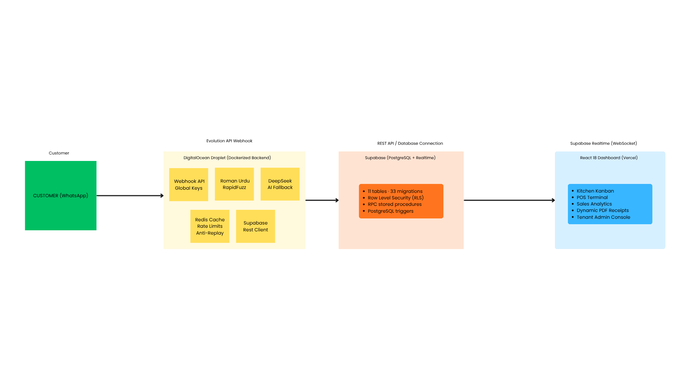
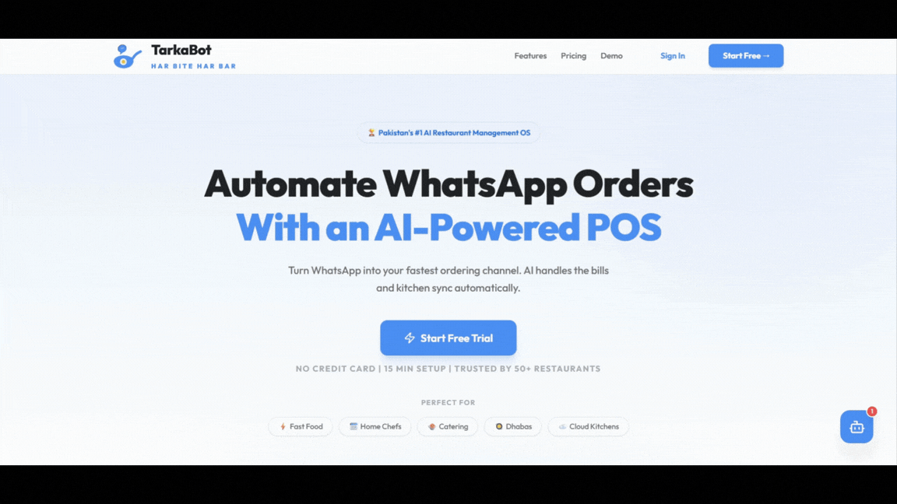

  

# 🍽️ TARKABOT — AI-Powered WhatsApp Restaurant Operating System (SaaS)

TarkaBot is a production-grade, multi-tenant B2B SaaS built to automate restaurant operations in Pakistan. It intercepts orders directly from WhatsApp via natural language (Roman Urdu/English), processes them with an **LLM-first AI order engine**, and beams them in real-time to a digital Kitchen Display System (KDS) and POS dashboard.

🌐 **Live Production:** [tarkabot.online](https://tarkabot.online)

---

## 🎯 Engineering Highlights & Achievements

Built over 3 months, this project evolved from a simple chatbot into a secure, distributed Restaurant OS handling full order lifecycles.

- **LLM-First AI Order Engine (Roman Urdu + English):** Orders are extracted by a **DeepSeek Chat API** agent that receives the tenant's *live menu, inventory stock, active order state, and recent conversation history* as context — it can only sell what's actually available. A pre-AI regex guardrail redirects casual chat without spending tokens, and robust JSON extraction ensures clean `order / update_details / chat` actions. Per-tenant bot persona, refund policy, and delivery rules are injected per restaurant.
- **True Multi-Tenancy:** Engineered strict data isolation using **PostgreSQL Row Level Security (RLS)** across 15+ relational tables. Tenants cannot cross-pollinate data, even at the raw database query level. Atomic writes go through `security definer` stored procedures (`create_order_with_items`, `update_order_status`).
- **Real-Time Distributed State:** Implemented **Supabase Realtime (WebSockets)** to instantly push confirmed WhatsApp orders to the React frontend (Kanban Kitchen Board), with a 5-second polling fallback if the websocket lags.
- **Enterprise-Grade Webhook Pipeline:** The **Evolution API** webhook (Supabase Edge Function) validates the sender instance, drops stale/sync messages (>15s) to prevent spam/replay, enforces subscription status + per-tenant message quotas before any AI call, and uses a **Redis**-backed rate limiter (in-memory fallback) on the operator endpoints.
- **POS & Thermal Printing:** Integrated `jsPDF` and `jspdf-autotable` to dynamically generate and print 80mm POS thermal receipts directly from the browser without dedicated driver installations.
- **AI Agent Guardrails:** Prompt-injection resistance (no key/prompt/DB disclosure), price-manipulation blocking, busy-mode, platform-level AI kill-switch, and disconnect alerts to restaurant owners via WhatsApp.

---

## 🏗️ System Architecture

  

**Order flow:** WhatsApp customer → Evolution API webhook → Supabase Edge Function (Deno) → DeepSeek LLM (live menu + inventory + history context) → structured JSON validated → atomic insert via RPC → Supabase Realtime pushes row to Kitchen Kanban → confirmation + tracking link back to customer.

---

## 📸 Platform Interface

*Updated Production Screenshots Coming Soon!*

| Landing Page | Dashboard |
|:---:|:---:|
|  | Coming Soon |

| POS Terminal | Menu Catalog |
|:---:|:---:|
| Coming Soon | Coming Soon |

| Print Settings | Sales Report |
|:---:|:---:|
| Coming Soon | Coming Soon |

---

## 🛠️ Deep Dive: The Tech Stack

### 🚀 WhatsApp Bot Engine (Supabase Edge Function — Deno)
- **AI Core:** `DeepSeek Chat API` for order extraction + conversational replies, with live menu/stock/history context injection and per-tenant persona prompts.
- **Intelligence Layer:** Pre-AI regex intent guardrails (casual-chat redirect, ordering keywords), robust JSON extraction from LLM output, raw-JSON leak prevention before replying to customers.
- **Resilience:** Busy mode, subscription expiry + quota checks before AI calls, human-like typing indicator + 2–3s delay via Evolution, conversation memory (last 8 messages per customer).

### 🚀 Backend Engine (Python / FastAPI)
- **Framework:** `FastAPI` + `Uvicorn` for high-throughput, async REST APIs.
- **Security:** JWT session verification (rejects anon/service-role tokens), tenant-ownership enforcement per endpoint, super-admin gating.
- **Caching & Rate Limiting:** `Redis`-backed rate limiter + replay guard with in-memory fallback for single-instance free tier.
- **Deployment:** `render.yaml` blueprint on **Render**; health-checked at `/api/v1/health`.

### 💻 Frontend Application (React 18)
- **Framework:** React 18, fully strictly typed with **TypeScript 5.6**.
- **State Management:** `TanStack React Query v5` for server state caching and optimistic UI updates.
- **Styling:** `Tailwind CSS 3.4` + `Framer Motion 12` for fluid micro-interactions.
- **Realtime:** `@supabase/supabase-js` WebSockets subscription to Postgres changes.
- **Deployment:** CI/CD pipeline integrated directly with **Vercel**.

### 🗄️ Database (Supabase PostgreSQL)
- **Schema:** 15+ core tables (`tenants`, `profiles`, `orders`, `items`, `categories`, `order_items`, `staff`, `inventory_items`, `recipes`, `whatsapp_sessions`, `notifications`, `webhook_logs`, `platform_activities`, `platform_config`, `tenant_users`) with strict foreign key constraints.
- **Security:** Extensive Row Level Security (RLS) policies with `is_tenant_member()` as the base policy helper — enabled on every table.
- **Performance:** B-Tree indexes on high-cardinality columns (`tenant_id`, `created_at`, `phone`).
- **Atomic Operations:** `security definer` RPC stored procedures handle multi-table transactions safely.
- **History:** 48 SQL migrations tracking full schema evolution — RLS hardening, RPC fixes, realtime setup, inventory/recipes, notifications.

---

## 🔒 Security & Privacy Notice

> **Note:** TarkaBot is a closed-source commercial SaaS product operating in production. The proprietary source code, internal logic, API keys, and customer data are maintained in a secure private repository.
>
> This showcase repository exists strictly for architectural documentation, technical deep-dives, and portfolio demonstration for engineering roles.

---

## 👨‍💻 Engineering Lead

**Muhammad Ahsaan Ullah**  
*AI Automation & Full-Stack Engineer*  
Architecting and scaling production-ready systems for modern businesses.

---

**TarkaBot — Modernizing the Restaurant Industry, One WhatsApp Message at a Time. 🇵🇰**

