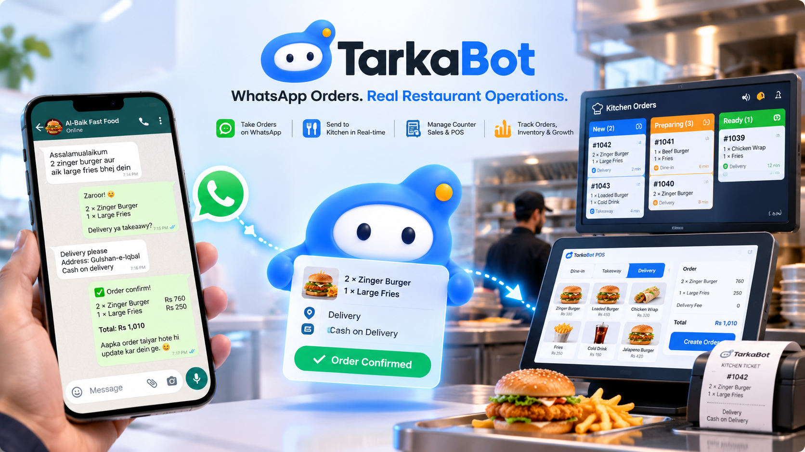
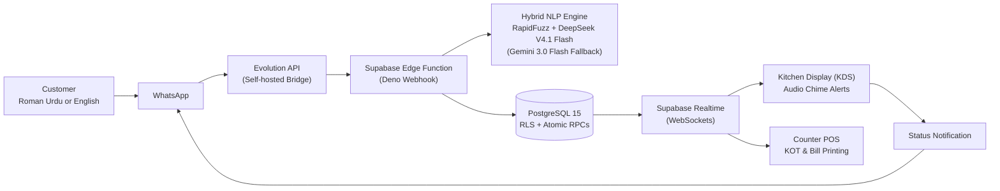

<div align="center">


# TarkaBot

### A WhatsApp-native restaurant operating system for Pakistan

Turn customer conversations into validated orders, send them to the kitchen in realtime, and manage counter sales from one multi-tenant platform.

[Live product](https://tarkabot.online) · [Product demo](https://tarkabot.online/demo) · [Help center](https://tarkabot.online/help) · [Security](https://tarkabot.online/security)


</div>



## The problem

Many independent restaurants in Pakistan already receive orders through WhatsApp. Staff must read each message, confirm missing details, calculate the total, copy the order into another system, and inform the kitchen. During busy dinner hours, this manual handoff causes dropped messages, billing errors, and kitchen delays.

TarkaBot connects that existing customer behavior directly to kitchen and counter operations. Customers order naturally in Roman Urdu on WhatsApp with zero marketplace commissions, while the restaurant receives structured kitchen tickets, counter POS billing, inventory deduction, and automated customer tracking updates.

## About this showcase

This repository documents the product, architecture, and engineering work behind TarkaBot. The production source code lives in a private repository because TarkaBot is a commercial SaaS product. No customer data, credentials, database migrations, or private production secrets are published here.

> 🌟 **Explore the Live Dashboard:**  
> If you want to experience the real product flow firsthand, please check out the live dashboard at [tarkabot.online](https://tarkabot.online) or test the interactive [product demo](https://tarkabot.online/demo). Feel free to explore the counter POS, kitchen screens, and settings—**your feedback, ideas, or architectural critique are genuinely appreciated and would mean the world to me!**

Recruiters and technical reviewers can use this page to understand the product scope, system design, security boundaries, and verified test coverage. A private technical walkthrough can be arranged when appropriate.

## How an order moves through TarkaBot


```mermaid
flowchart LR
    C["Customer<br/>Roman Urdu or English"] --> W["WhatsApp"]
    W --> E["Evolution API<br/>(Self-hosted Bridge)"]
    E --> F["Supabase Edge Function<br/>(Deno Webhook)"]
    F --> NLP["Hybrid NLP Engine<br/>RapidFuzz + DeepSeek V4.1 Flash<br/>(Gemini 3.0 Flash Fallback)"]
    F --> D[("PostgreSQL 15<br/>RLS + Atomic RPCs")]
    D --> R["Supabase Realtime<br/>(WebSockets)"]
    R --> K["Kitchen Display (KDS)<br/>Audio Chime Alerts"]
    R --> P["Counter POS<br/>KOT & Bill Printing"]
    K --> N["Status Notification"]
    N --> W
```

The webhook loads the restaurant's current menu, item availability, delivery rules, payment methods, assistant persona, and recent conversation context. Orders are extracted via a tiered NLP engine (RapidFuzz for 0ms deterministic menu matching, DeepSeek V4.1 Flash for complex conversational intent, with Gemini 3.0 Flash as an automated fallback). An atomic database transaction creates the order and line items while enforcing inventory and quota constraints.


## Product tour

### Order through WhatsApp

Customers can ask about the menu and place an order in Roman Urdu or English. The assistant collects customer details, delivery location, and payment preference (Cash / Card / JazzCash & EasyPaisa QR) before confirming the order.


### Run the kitchen & counter in realtime

Confirmed WhatsApp and counter orders appear on the kitchen display board instantaneously via Supabase Realtime with audible chimes. Staff move orders through visual stages (**New → Preparing → Ready for Pickup**) and dispatch riders without price distractions.

The point-of-sale screen supports dine-in, takeaway, and delivery orders. Cashiers can calculate tender/change, record payment modes (Cash, Bank Card Machine, JazzCash/EasyPaisa QR), recover unfinished carts across tab reloads, and print separate:
- **KOT (Kitchen Order Ticket):** Large item quantities, preparation instructions, no prices.
- **Customer Bill:** Itemized breakdown, GST/discounts, tendered cash, change return, and payment status.


### Menu & inventory intelligence

Menu availability dynamically reacts to recipe ingredient stock. If ingredients run low or out of stock, the system automatically marks items unavailable so the AI assistant only sells what the kitchen can actually prepare.


## What TarkaBot includes

- **AI WhatsApp waiter**: menu questions and guided ordering in Roman Urdu or English
- **Restaurant-specific context**: menu, prices, stock, timings, delivery areas, payments, policies, and assistant persona
- **Kitchen workflow**: realtime orders, audible alerts, preparation states, rider details, and customer notifications
- **Counter POS**: dine-in, takeaway, and delivery orders with KOT and customer receipt printing
- **Catalog and inventory**: categories, items, offers, recipes, ingredient stock, and availability controls
- **Sales operations**: revenue views, order-source breakdowns, shifts, and PDF exports
- **Multi-tenant administration**: staff roles, subscriptions, quotas, platform controls, and audited impersonation
- **Customer tools**: public menu, secure order tracking, payment receipt flow, and WhatsApp updates


<p align="center"><sub>TarkaBot connects customer ordering, kitchen work, counter sales, inventory, reporting, and tenant administration.</sub></p>

## Why these features are useful

| Restaurant task | How TarkaBot helps |
| --- | --- |
| Receive direct orders | Customers order through the WhatsApp app they already use, without installing another application |
| Understand informal messages | The assistant handles Roman Urdu and English conversations using the restaurant's own menu and policies |
| Reduce manual re-entry | A validated WhatsApp order becomes a structured kitchen order instead of a message that staff must copy |
| Keep the kitchen informed | Realtime order states give counter and kitchen staff a shared view of what is new, preparing, or ready |
| Handle walk-in customers | The same system accepts counter orders and prints separate kitchen (KOT) and customer receipts |
| Avoid selling unavailable items | Menu availability, recipes, and ingredient stock inform what the restaurant can accept |
| Keep customers updated | Tracking links and WhatsApp notifications reduce repeated “order kahan hai?” calls |
| Operate more than one restaurant | Tenant boundaries keep each restaurant's menu, staff, customers, orders, and assistant context separate |
| Review performance | Sales views, shift reconciliation, and order-source reporting help owners understand daily operations |

## How TarkaBot is different

TarkaBot connects the customer conversation directly to physical restaurant execution. Its value comes from the complete operational loop, not from an isolated chatbot or a generic counter screen.

| Capability | Marketplace aggregator | Basic WhatsApp chatbot | Traditional POS | TarkaBot |
| --- | :---: | :---: | :---: | :---: |
| Restaurant-owned WhatsApp ordering | Limited | Yes | No | **Yes** |
| Roman Urdu conversational ordering | Limited | Varies | No | **Yes** |
| Live restaurant menu and availability context | Varies | Usually limited | Yes | **Yes** |
| Structured order sent to the kitchen | Yes | Usually no | Counter orders only | **Yes** |
| Counter POS and dual KOT receipt printing | No | No | Yes | **Yes** |
| Customer tracking and status messages | Yes | Limited | Usually no | **Yes** |
| Inventory and recipe awareness | Varies | No | Varies | **Yes** |
| Multi-tenant SaaS administration | Platform controlled | Varies | Varies | **Yes** |
| 0% Marketplace Commission | No (25–32%) | Yes | Yes | **Yes (0%)** |

## Engineering decisions

### Enforce tenant boundaries in the database kernel
PostgreSQL Row Level Security (RLS) protects tenant-owned data across all tables. FastAPI verifies Supabase session tokens and enforces tenant claims before protected operations. Privileged database functions validate ownership before writing data.

### Create each order as an atomic transaction
The `create_order_with_items` database function writes the order, its line items, customer records, and inventory deductions within a single ACID transaction. A partial failure rolls back cleanly, preventing orphan orders or stock drift.

### Tiered NLP for cost & latency optimization
Instead of passing every inbound message to an LLM, standard items are resolved in **<12ms via Levenshtein fuzzy string distance (`RapidFuzz`)** at zero token cost. DeepSeek V4.1 Flash is invoked for complex, multi-item or ambiguous phrasing (with Gemini 3.0 Flash as an automated fallback), maintaining per-order AI costs below **0.02 PKR**.

### Keep the kitchen usable when connections fluctuate
Supabase Realtime pushes order changes over WebSockets with automatic reconnection. In addition, counter POS carts persist to local storage with crash hydration, ensuring no walk-in orders are lost if a browser tab is refreshed during a rush.

### Keep secrets outside the client bundle
All API credentials, service-role keys, and webhook HMAC secrets remain strictly in server environments. Restricted CORS, strict security headers, rate limiting, and replay guards protect external boundaries.

## Technology

| Area | Stack |
| --- | --- |
| Web application | React 18, TypeScript 5.6, Vite 5, Tailwind CSS, TanStack Query |
| Backend API | FastAPI, Python 3.11, Pydantic, PyJWT, Redis |
| WhatsApp and AI | Evolution API, Supabase Edge Functions (Deno), DeepSeek V4.1 Flash, Gemini 3.0 Flash (Fallback), RapidFuzz |
| Data platform | Supabase PostgreSQL 15, Auth, Realtime (WebSockets), Row Level Security |
| Receipts and reports | jsPDF, Thermal KOT printing, Customer bill printing, PDF exports |
| Deployment | Vercel (Frontend), Render (Backend API), Supabase (Database & Functions) |

## Verification

The automated test suites cover authentication, tenant authorization, messaging, notifications, subscription billing, secure order tracking, POS receipts, cart recovery, totals, sanitization, and route behavior.

| Suite | Verified result | Coverage examples | Command |
| --- | ---: | --- | --- |
| Frontend | **74 tests passing** across 20 files | Billing flows, order tracking, POS receipts, cart recovery, totals, sanitization | `npm test` |
| Backend | **36 tests passing** | Authentication, tenant access, messaging, notifications, rate limiting | `pytest backend/tests` |
| **Total** | **110 tests passing** | Full end-to-end multi-tenant platform coverage | `All green` |

The production frontend compiles with zero TypeScript errors and passes production bundling:

```bash
npm run build
```

## Project status

TarkaBot is deployed at [tarkabot.online](https://tarkabot.online) and is currently in private beta. Manual bank-transfer billing is in use while automated payment integration is prepared.

This public repository contains documentation and product architecture only. The application source code remains private.

## About the developer

I'm **Muhammad Ahsaan Ullah**, a full-stack and AI engineer based in Pakistan. I designed and built TarkaBot across product design, React, FastAPI, PostgreSQL, multi-tenant security, WhatsApp automation, AI integration, automated testing, and deployment.

If you have a moment to explore the live dashboard or demo, I would love to hear your thoughts and feedback!

[GitHub](https://github.com/MAhsaanUllah) · [LinkedIn](https://linkedin.com/in/mahsaanullah) · [Live product](https://tarkabot.online)

## License

Copyright © 2026 Muhammad Ahsaan Ullah. All rights reserved. TarkaBot, its source code, product design, and documentation are proprietary and are not licensed for reuse, redistribution, or commercial deployment.
